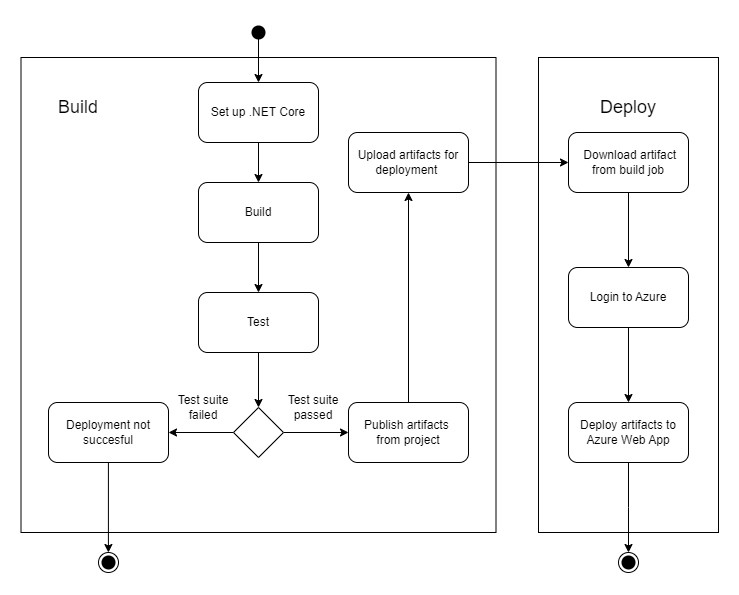
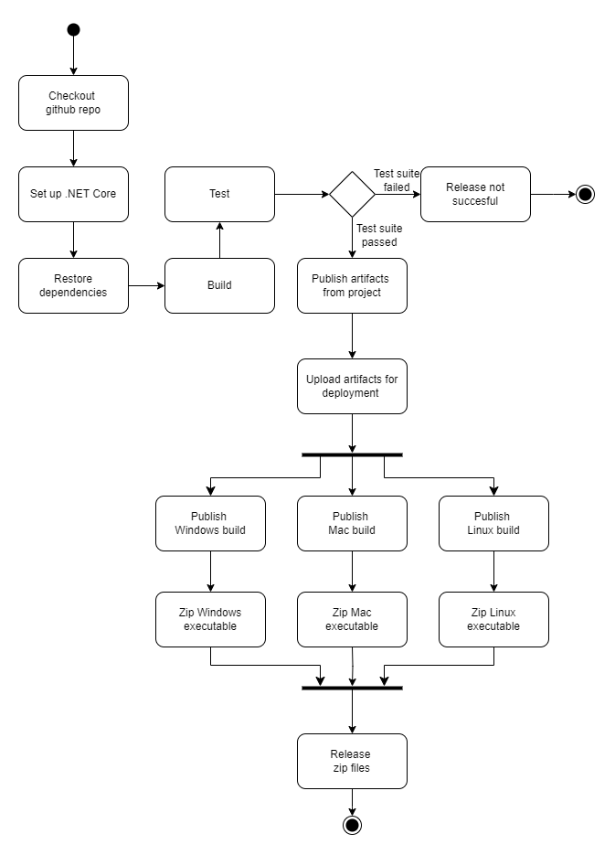

| **Title**              | **Subtitle**           | **Author**                               | **Numbersections** |
|------------------------|------------------------|------------------------------------------|--------------------|
| _Chirp!_ Project Report | ITU BDSA 2024 Group `21` |`Mathilde Secher Marcussen <msem@itu.dk>` <br>`Kristoffer Spicker <kspi@itu.dk>`  <br> `Lars Andreas Metsälä Wulff <lawu@itu.dk>` <br> `Stine Wittendorff Petersen <stwp@itu.dk>` | True              

[GitHub](https://github.com/ITU-BDSA2024-GROUP21/Chirp)

# Design and Architecture

## Domain Model


The diagram seen above illustrates the classes and interfaces that make up our program, with connections drawn between classes that rely on other parts. As can be seen above, and will be further discussed below, the NooterService class separates the core and infrastructure parts of the system from the user interface. This is evident when looking at the diagram, as there is a clear distinction above and below NooterService.


## Architecture - In the small
We built our project using Onion architecture, which is an architectural pattern for software development, that consists of a core and layers connected to that core through inward interfaces.  In our case, we have a core consisting of the basic structs, which are then used in constructing the methods in their separate repositories. These then contain methods that are connected to the different structs, such as the method for creating an author being inside the AuthorRepository.  
The next layer contains the NooterService class and interface. In this class, we implement all the methods found in the repositories so they can be called later by classes used for the user interface. The difference between the methods in the service and the repositories is that the queries on the database are run exclusively from the repository classes.  
The penultimate layer of our architecture contains all the classes that built the web service and the various functionalities found on the website. This includes the homepage, about me page, and functionalities like login and register. The classes contain only dependencies to the NooterService interface for the use of methods.  
Finally, the outermost layer contains our test suite. Specifically the playwright tests interact exclusively with the user interface, but in order to make thorough testing, the assertion test suite tests all layers. 

Onion diagram:  
<div align="center">
  
</div>


## Architecture of deployed application
<div align="center">
  
</div>

The diagram above shows the different components of our Nooter application. It shows that the client interacts with the web server and, through that, the web application. It also shows how the web application interacts with the application service to store and fetch data about the users, noots, who they are following, and so on. As illustrated, it is all deployed on Microsoft Azure, which is why that component is drawn as a large component outside of our application.


## User activities 


<div align="center">
  
</div>

The activity diagram above visualizes the process of an unauthenticated user, who wants to experience the website without being authenticated. The root page of the website is the public timeline, which is displayed first, before they press the register button and the register page is displayed. Finally, they press the login button, which displays the login page. The user has now gone through all the different pages an unauthenticated user can visit, save from the multiple pages of the public timeline.


<div align="center">
  
</div>

This activity diagram shows an unauthenticated user who wants to register an account and display their private timeline. When the user clicks the register link, they will be redirected to the register page, where the user has to enter their username, email, and the password they want for their account. If the information for username, email, or password is invalid, the user stays on the register page and is provided an error message. If the information is valid, the user is logged in and redirected to the public timeline, where the user then has the option to navigate to their own private timeline. 


<div align="center">
  
</div>


The purpose of this activity diagram is to show the user activity when a user logs in and navigates to their private timeline. The user starts on the root, which is the public timeline. By clicking the login link, the user will then be redirected to the login page. The user can then enter their email and password for their account and then click the login button. If the login attempt is valid, the user will be logged in and redirected to the public timeline. The user can then click on the *My timeline* button, and be redirected to their private timeline. 


<div align="center">
  
</div>

The activity diagram shown above is a continuation of the previous diagram, where the user has just logged in before navigating to their private timeline. The user is now authenticated and have more options with the program. In this diagram the user wants to log out again. They start by clicking the logout *username* and will be redirected to the logout page. The logout page contains a button *Click here to log out*. When the user clicks that button, the user is logged out and redirected to the login page. 


<div align="center">
  
</div>

In the diagram above, the process of an authenticated user who follows and unfollows another user is portrayed. When the authenticated user is on the public timeline, the Noots from other users are shown along with a follow icon. The user clicks the follow button and now follows the other account. Then user navigates to the private timeline. Both the user's noots and the noots from the users who they follow will now appear. The user will then click the unfollow icon, and the private timeline will reload without the now unfollowed users' noots.

<div align="center">
     
         
</div>

The authenticated user can also send a noot. Firstly the user has to log in. In the leftmost diagram, the user types the noot they want to share in their private timeline. In the diagram on the right, it shows the user typing the noot whilst on the public timeline. The program does not explicitly check if the noot is valid, because it is not possible to type an invalid noot, due to our implementation of the Nootbox. When the noot is shared, no matter if the user shared it whilst on the private or public timeline, they will be redirected to the public timeline, and the new noot is shown along other noots. 


<div align="center">
  
</div>

The activity diagram above showcases another feature, to which an authenticated user has access. When the user is logged in, the user will click the *About Me* link, which will redirect the user to the *About Me* page, where it is possible to click the *Forget Me!* button. When this button is pressed, the account will then be deleted, along with all their noots, follows, and other personal data. The now unauthenticated user will be redirected to the login page.


## Sequence of functionality/calls through Chirp!

 
The sequence diagram models an interaction, where an unauthenticated user requests the root page. The user does this, by clicking the URL to the website hosted on Azure. Clicking this link on the browser, makes the browser send an HTTP GET / request, in order to request the root page. 
The root page looks different, depending on whether or not the user is authenticated. If an authenticated user sees this page, it will include access to additional functionalities, such as the buttons for private timeline, "Nooting" and following other users. However, if the user is not authenticated, these will of course be hidden. Therefore, it is vital for the server to know if the user is authenticated, in order to respond to the HTTP request with the appropriate data.

The server then sends a request to the backend in order to authenticate the client. In this case, we know that the Actor is not authenticated, and therefore the backend returns false. Now the server knows what site to request, and sends a request to the backend for that site. The backend sends a request to the database for the necessary data which is displayed on the root page, such as users and noots, and combines it with the html. This is now sent as a response to the server's query, which in turn now has an html webpage to respond to the original browser request with. Finally, the actor can now interact with the root page on his browser as an unauthenticated user. 


# Process

## Build, test, release, and deployment

<div align="center">
  
</div>

Our build and test workflow is the most essential, as the program shall at all times be able to do these things. We activate this workflow on pushes or pull requests on main, such that branches with experimental features and logic can exist, but nothing can be merged to main without passing this workflow. As our test suite is essentially split into two, so is our workflow; into a Playwright test suite and an assertion test suite. The assertion test suite only does the standard .NET procedure of restoring dependencies, then building the project, and then running the test suite. In theory, any of those steps can break the workflow. However, as seen in the diagram, it is assumed that mainly the test suite itself is subject to failure. If it does fail, the activity ends, and the tested software will have to be rewritten.

Likewise with the playwright test suite, but there are some minor additions. Primarily, our Playwright test suite implementation requires an absolute path. This is fixed by using `${GITHUB_WORKSPACE}` and assigning it to an environmental variable that, if set, has priority in the codebase. Furthermore, the Playwright browsers also needs to be installed each time the workflow runs. This means that it takes a lot more time and computational power to run the Playwright test suite than it does to run assertation tests. Therefore, this is the only workflow that includes the playwright test suite, whilst the others also contain the assertation test suite in order to not deploy or release bug-inducing code.

<div align="center">
  
</div>


The build and deploy workflow is responsible for the automatic deployment of the main branch to Azure. This workflow has two different objectives: To build the artifacts that Azure needs and then deploy them. In order to build the artifacts, the standard .NET procedure is used, with setting up the .NET Core and building the project. Then the assertation test suite is run, as an extra precaution, even though no code on main should break this test suite as we have multiple fail-safes. If the tests are passed, the artifacts are published from the project and uploaded for use in the Deploy job.

The first step in the Deploy job is to download the aforementioned artifacts, before logging in to Azure. Now that the workflow has the artifacts needed to run the program, as well as being logged in to the correct Azure account, it can deploy the artifacts directly to the Azure Web App.

<div align="center">
  
</div>


The build and release workflow is activated each time a new version tag is released. Once again, the standard .NET procedure is done, and the extra safety in running the assertion test suite before anything else is also considered good practice by us. Once the tests pass, the artifacts are published before being uploaded, in order for the different operating systems to copy them. Windows, Mac, and Linux builds are published and zipped independently of one another before being released. 


## Team work


After each lecture, we had a short meeting and wrote down the issues for the coming week on our project board. We tried to split the given assignments into smaller issues. This meeting gave us an overview of how far we were with the issues from the previous week, and what needed to be implemented during the following week. As the workload varied between weeks, this gave us the opportunity to adapt to each week and make sure we did not get behind schedule. We primarily met to work on the project on Monday, Tuesday, and Wednesday, where we focused on the bigger implementations and the parts where we felt it was important everyone took part in the process.  
If more hours were needed, we worked separately during the rest of the week to account for other courses, work, and other obligations. We would then agree on a deadline, so everyone knew exactly what tasks they were assigned and when to have them done. In case we were prevented finishing the assignment we were given, we made sure to notify the group before the meeting the next meeting.  
We attempted to work in trunk-based development in regard to our version control. Each time a new feature was to be worked on, a corresponding branch from main would be created. When the feature/implementation was finished a pull request was created to merge the new feature into main. A reviewer would be requested for the pull request, preferably someone who had not worked on the feature. This was both to ensure that no one missed something in their own implementation when merging, but also to include everyone and make sure that we all knew all aspects of our program. If all group members had worked on the implementation, we would still create a pull request which had to be approved, to look through what had been changed before pushing it to main. 
We tried to keep the branches as short-lived as possible. This was more difficult than we first imagined, and sometimes branches got so behind main that main had to be merged into these feature branches. However, largely the branches were not too static, and we definitely improved this during the course. 
In the beginning, we mostly did mob programming to make sure everyone was involved in all aspects of the program. However, as we got more issues and everyone had a base understanding of the program, we switched to pair- or even solo-programming. However, everyone was always available to help each if needed.


## How to make Nooter work locally


### Step 0: Prerequisites

1. [.NET 8 SDK](https://dotnet.microsoft.com/download/dotnet/8.0)
   - Required to build and run the application.

2. SQLite
   - System-level installation may be required for some platforms:
     - Linux: `sudo apt install sqlite3`
     - macOS: `brew install sqlite`
     - Windows: Typically pre-installed.
3. [Powershell](https://github.com/PowerShell/PowerShell)
   - Required for installing Playwright browsers to run the Playwright test suite

### Step 1: Clone the repository

In the terminal of your choice, navigate to the directory where you want Nooter to be located. Then, copy and paste the following command: 
```bash
git clone https://github.com/ITU-BDSA2024-GROUP21/Chirp.git
```

If this fails, navigate to the online repository: `https://github.com/ITU-BDSA2024-GROUP21/Chirp`. Click the green "code" button, and choose the "Download Zip" option. Move the downloaded zip-file to the directory of your choosing and unzip it.

### Step 2: Running Nooter 

The application is built on .NET, which makes running the program fairly easy. The terminal used in [Step #1](#step-1-clone-the-repository) should still be in the root of your local clone of Nooter. If not, navigate to it, in a terminal of your choice. Then run the following command:
```bash
dotnet run --project src/Chirp.Razor/Chirp.Web
```

This will host the local Nooter clone on localhost. The default port is: [https://localhost:5273](https://localhost:5273).


## How to run test suite locally

### Assertion testing
   
In order to run the assertion test suite, you need to navigate to the root of your local clone of Nooter in a terminal of your choice. Then, run the following command:
```bash
dotnet test test/Chirp.Razor.Tests
```

### Playwright testing
   - In order to run the Playwright test suite, you need to have one of two prerequisites:
    
       1. Have the program running locally in the background, as described in ["Running Nooter"](#step-2-running-nooter)
       2. Change the defaultPath variable in `PersonalProjectPath.cs` to the string of the absolute path of `src/Chirp.Razor/Chirp.Web` on your computer. `PersonalProjectPath.cs` is located in `test/Chirp.Razor.Tests/PlaywrightTests`.
          
   - Once either of these prerequisites are met, simply run this command from the root of your local clone of Nooter:
     ```bash
     dotnet test test/Chirp.Razor.Tests/PlaywrightTests
     ```


To test our program thoroughly we have used several different types of tests. We have used Playwright Test to test the UI Components of our web application. Here we have used a mix of End-to-End, integration, and unit testing to test the UI. The unit test is focused on very small parts of the program where the End-to-End test is used to test every single page works as intended. In these tests, we check that all the pages on our web application shows what we expect them to show and that the different functionalities as buttons do as we expect them to.

Besides that, we have assertion tests which include unit test and integration tests. These tests test the logic behind the functionality of our program. Other things that are tested include testing that our users get created the right way and are stored correctly in our database. The test exists for noots. We also test that the follow and unfollow functions work as intended and that we can delete our noots and users as intended.

# Ethics

## License
We chose the MIT license due to it protecting us from any liabilities whilst still being highly permissive and allowing everyone to copy, modify or otherwise use our implementation. Furthermore, we trust the license as it is one of the most widely used open-source licenses in 2024.[^1]

[^1]: https://www.blackduck.com/blog/top-open-source-licenses.html

## LLMs, ChatGPT, CoPilot, and others
We have used `ChatGPT` in small amounts. `ChatGPT` was mainly used for explaining core concepts and helping debug code parts we were stuck on. If we had been stuck on the same code for several hours or days, we might have used `ChatGPT` as a tool to help spark ideas for how to fix the issue. \
The responses from `ChatGPT` were often useful, but it was far from consistent. The answers given by `ChatGPT` would sometimes not be what we needed or were looking for, and could end up wasting more time if we were not critical of its responses. Overall we did benefit from it, however. \
We did not `Co-author` `ChatGPT` on our commits, because we never took any actual code from it, we only used it as a helping tool to guide us in the right direction or to pinpoint the problem, so we knew where to look in our code. \

No other LLM was used. `CoPilot` was used, but mainly as an extension to Intellisense. No problems or issues of magnitude were solved thanks to it.  \
The reason we did not use AI more was in no small part due to the environmental consequences of these technologies, which worry us greatly. Furthermore, plagiarization and the fact that this project was made by us in order to learn, made the negative implications of these technologies greater than the benefits for this project. \
None of this report was in any way written or influenced by `ChatGPT`, nor any other generative AI.

# Other technologies
### HackMD
This report was written in HackMD. We chose this editor as it allowed us to write to it simultaneously, like Google Docs, instead of having to merge different documents on GitHub. [HackMD](https://hackmd.io)
### PlantUmlClassDiagramGenerator
The classes for the class diagram were written in PlantUml and assembled manually. However, to assist us in making the PlantUml diagrams we used this tool. [GitHub](https://github.com/pierre3/PlantUmlClassDiagramGenerator) 


# Future Work
We discovered the day before handing in our report, that our program crashes when we try to register a new account with an existing email. The issues is located somewhere in the Razor Page scaffolded pages, and therefore we concluded that it would be an issue that we would not be able to solve before the hand-in.   

E-mail is currently not authenticated when registering a new user. We removed this functionality, due to it creating bugs regarding GitHub authentication, and the functionality merely being to click a link, in order to verify the e-mail. If we were to keep working on this project, proper e-mail authentication would be a high-priority feature we would like to implement.  

It would also be beneficial to add a register partial class, just like the `_loginpartial.cs`class. In this class, we would check if a user is authenticated rather than placing this check in every class where a user can be located on our site, for better code practice.
Additionally there are many custom features such as profile pictures, like-functionality, and a PageRank algorithm we would have implemented, had we had more time.

